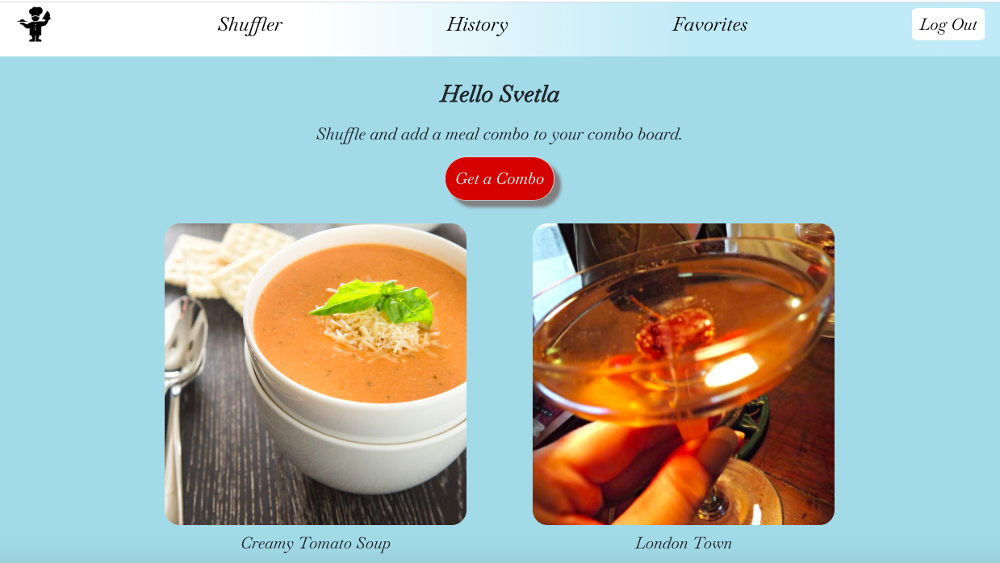

## Project Overview

A meal & drink suggestion app for indecisive eaters.



## Project Description 

Crave is an app that helps the user generate a random meal and drink combo so that they don’t have to decide on one. The app requires users to register first, then log in. Then they come to the home page where they can shuffle a meal & drink combo by pressing a button. Doing this adds the combo to their combo board. In the combo board the user has the option to delete a combo, get more info on the combo, and add it to favorites. 
 
## Feature List 

* Auth - register,login,logout  
* Shuffle button to generate a random combo 
* Access to personalized board of meal and drink combos as well to a favorites
* Access to all user's combos
* Favorites Category 
* Recipes Category
* Add,delete or edit a comments to a combo


## Frameworks
React.js, Express.js

## MVP /POST MVP
### MVP
* Working API  endpoints and conditional rendering with React.
* Access to board, favorites,  recipes and their corresponding buttons allowing users for CRUD operations.
* Form validation.

### POST MVP
* Get a board of all users.
* Add ingredients to the recipe table.


## Wireframes 
Sketches of the user interface with notes of how the user will interact with the UI.
Wireframes should be broken into components which then should be described in a component heirarchy.
##React Component Heirarchy 

## Components 
| Components    | Description   | 
| ------------- |:-------------:| 
| Header  | This component will render the header. |    
| Footer    | This component will render the footer.    |            
| Nav       | Renders the nav bar and logout button. |
| RegisterForm  | This component will render a register form. |    
| LoginForm     | This component will render a login form.     |            
| Login         | This component contains login form functionality.    |
| ComboBoard    | This component will render a board with all of the combos of the user logged in |  		           
| Faves         | This component will render the favorites category of the user.    |    	           
| RecipeInfo    | This component will render a list of combo recipes from the board.     | 		           
| ComboBoard    | This component will render each combo in the board.   |    	           
| FavoriteCard  | This component will render each combo in the favorites page.    | 
| RecipeForm    | This component will render a combo recipe in the recipe page.    | 
| AllCombos      | This component will render a page with all user's combos |
| ComboDetails  | This component will render the comments on combos |
| MakeCombo     | This component will render the combo shuffler    |
| Shuffler      | This component will render the the photos and names of items |


## Express Routes 
`server.js`

```
  app.use('/users', userRouter);
  app.use('/combos', comboRouter);
  app.use('/comments', commentRouter);  
```

### userRouter

| Method       | Endpoints      | Description  |
| ------------- |:-------------:|    :-----:    |
| POST         | `/ `        | Register a user.|
| POST         |  `/login `  |Login a user.  |
| GET          | `/verify  `    |Load a token from localStorage when accross the app and verify it is valid |

### comboRouter

| Method       | Endpoints     	 | Description  |
| ------------- |:-----------:|    :-----:       |
| GET           | `/`           	| Get all combos by all users (not sure if we will use that)|
| GET           |  `/user/:id `  | Get all user's combos.  |
| POST          | `/user  `		| Add a combo to the board.   |
| DELETE          | `/user/:id  `| Delete a combo from the user's board and from the database.   |
| POST          | `/user/favorites  `| Add a combo from the boards to favorites.   |
| POST         	| `/user/recipes`  |  Can add a recipe to the recipe list.   |


### commentRouter 

| Method       | Endpoints      | Description                       |
| ------------- |:-------------:|    :-----:                        |
| GET           | `/`       	  | Get all recipes of the board.     |
| PUT         	| `/:id  `  	  |  Can add a comment to a recipe.   |
| DELETE         | `/:id`  	  |  Delete a recipe.                 |


## Time Estimates(Front End)

| Component 	  | Priority       | Estimated Time | Time Invested   | Actual Time    |
| :---         |     :---:      |          :---: |      :---:      |      ---:      |
| LoginForm    | high  			  |  3h   	         |TBD              | TBD            |
| Logout   |      high 			|      30min           |TBD              | TBD            |
| RegisterForm  |  high  		 | 3h   |TBD              | TBD            |
| Board    |  high     			| 3.5h     |TBD              | TBD            |
| Faves   |  low  				| 4h  |TBD              | TBD            |
| Recipes     |    low   		| 2.5h      |TBD              | TBD            |
| BoardCard   |   high 			|   1h  |TBD              | TBD            |
| RecipeCard    |    low    	|   1h    |TBD              | TBD            |
| Total   |      	|    16h  |          |            |


##List Dependencies 

[The MealDB API](https://www.themealdb.com/api.php) 

[CoctailsDB API](https://www.thecocktaildb.com/)


## Additional libraries
| Library       | Function      | 
| ------------- |:-------------:| 
| `react-image`   | ` `tag replacement for React.js, featuring preloader and multiple image fallback support. |  
| `react-bootstrap`    | great library for grid layouts and mobile responsivness since we will render pictures    |  
